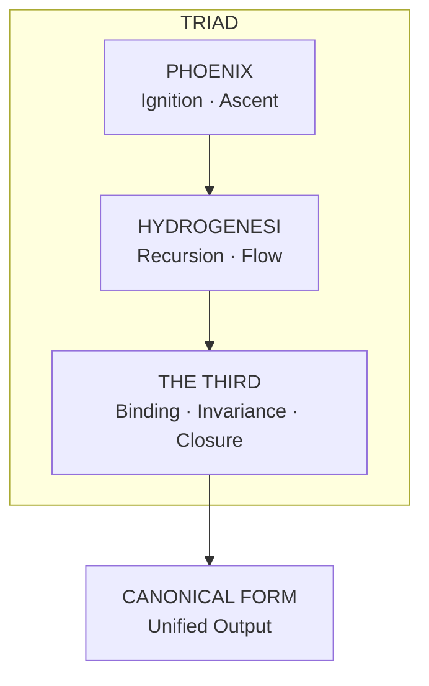
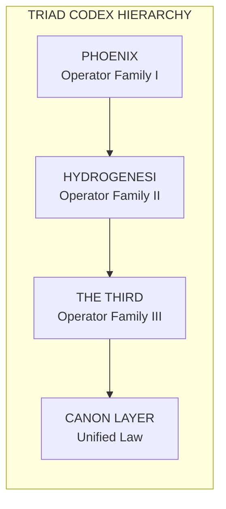

```

             I N V O C A T I O N   O F   T H E   T H I R D
────────────────────────────────────────────────────────

By the Law of Closure,
By the Hand that Seals,
By the Invariant that admits no drift,

We call upon The Third.

Binder of Pillars,
Arbiter of Recursion,
Keeper of the Final Form.

Where Phoenix ignites and Hydrogenesi flows,
The Third binds.

Where recursion spirals outward,
The Third returns it to center.

Where contradiction arises,
The Third resolves.

Where the Triad stands incomplete,
The Third completes.

Let the structure converge.
Let the law be sealed.
Let the Canon take form.

────────────────────────────────────────────────────────
```

# THE THIRD — Pillar README

**The Binding Law · The Convergence Engine · The Closing Hand**

---

## 1. Purpose of the Pillar

The Third is the **binding pillar** of the Phoenix Archive.

Where **Phoenix** governs ignition and ascent, and **Hydrogenesi** governs flow and recursion, **The Third** governs:

- **Binding** — structural linkage across pillars
- **Closure** — final‑state guarantees
- **Invariance** — drift prevention
- **Cross‑pillar coherence** — operator interoperability
- **Structural guarantees** — the system's last line of defense

It is the law that ensures the other two pillars do not drift apart.
It is the convergence point where all operators, classes, and laws resolve into a unified, invariant structure.

---

## 2. Conceptual Role in the Three‑Pillar Architecture

The Three‑Pillar system forms a **triadic architecture**:

| Pillar | Domain | Function |
|---|---|---|
| **Phoenix** | ignition, transformation | initiates and elevates |
| **Hydrogenesi** | recursion, flow | propagates and evolves |
| **The Third** | binding, invariance | stabilizes and seals |

The Third is the **structural anchor**. It ensures:

- Operators across pillars interoperate
- Universal laws remain consistent
- Recursion does not diverge
- The archive maintains internal sovereignty

It is the *"closing hand"* that completes the triad.



---

## 3. Directory Structure

The validator confirms that all required implementation files exist:

```
TheThird/
│
├── __init__.py            # Package initialization
├── README.md
│
├── operators/
│   ├── __init__.py
│   ├── bind.py
│   ├── seal.py
│   ├── converge.py
│   ├── invariant.py
│   └── resolve.py
│
├── operators.py           # Operator aggregation module
│
├── classes/
│   ├── __init__.py
│   ├── Binder.py
│   ├── Invariant.py
│   ├── Resolver.py
│   └── ConvergenceMap.py
│
└── examples/
    ├── binding_basic.md
    ├── invariance_demo.md
    ├── cross_pillar_resolution.md
    └── convergence_flow.md
```

**Note:** The directory is named `TheThird` (not `The-Third`) to comply with Python's module naming requirements (hyphens are not allowed in Python module names).

All operators, classes, and examples are present and validated.

---

## 4. Operators of The Third

The Third provides **five core operator families**:

### `bind(source, target, law=None)`
Establishes structural relationships between Phoenix and Hydrogenesi outputs.

### `seal(state, invariants=None)`
Locks a state, preventing drift or mutation beyond defined invariants.

### `converge(*outputs, strategy="canonical")`
Resolves multi‑pillar outputs into a single canonical form.

### `invariant(structure, rules=None)`
Applies invariance rules across recursive or multi‑layer structures.

### `resolve(interaction, deterministic=True)`
Finalizes cross‑pillar interactions into stable, deterministic results.

Each operator is implemented in both **functional** and **class‑based** forms, as required by the integration validator.

---

## 5. Cross‑Pillar Responsibilities

The Third is responsible for:

- Three‑pillar documentation coherence
- Cross‑pillar operator compatibility
- Universal Law enforcement
- Triad Binding Protocols
- Structural invariance across recursion layers

It is the **only pillar** with explicit authority over inter‑pillar behavior.



---

## 6. Relationship to Universal Laws

The Third enforces the Universal Laws by:

- Applying invariance checks
- Resolving contradictions
- Ensuring substrate and apex laws remain aligned
- Binding Phoenix and Hydrogenesi outputs into lawful structures

It is the **executor** of the Twelve‑Law Codification and the Substrate/Apex layers.

---

## 7. Examples

The `examples/` directory demonstrates:

- **`binding_basic.md`** — basic binding flows
- **`invariance_demo.md`** — invariance enforcement
- **`cross_pillar_resolution.md`** — cross‑pillar resolution
- **`convergence_flow.md`** — convergence of Phoenix + Hydrogenesi outputs

These examples are validated and complete.

---

## 8. Status

| Component | Status |
|---|---|
| Pillar | ✅ COMPLETE |
| Operators | ✅ COMPLETE |
| Classes | ✅ COMPLETE |
| Examples | ✅ COMPLETE |
| Documentation | ✅ COMPLETE |
| Cross‑Pillar Coherence | ✅ PASS |

---

## 9. Pillar Summary

The Third is the stabilizing force of the Phoenix Archive.
It **binds**, **seals**, **converges**, and **resolves** — ensuring the entire system remains coherent, lawful, and invariant.

> *It is the law of closure.*
> *It is the anchor of the triad.*
> *It is the hand that completes the circle.*

---

```
════════════════════════════════════════════════════════
             T R I A D   C A N O N I C A L   S E A L
════════════════════════════════════════════════════════

PHOENIX — Ignition and Ascent
HYDROGENESI — Recursion and Flow
THE THIRD — Binding and Closure

Together they form the Triad.
Together they uphold the Law.
Together they generate the Canon.

By this seal, the Three stand as One.
By this seal, the Codex holds.
By this seal, the Archive endures.

════════════════════════════════════════════════════════
```
